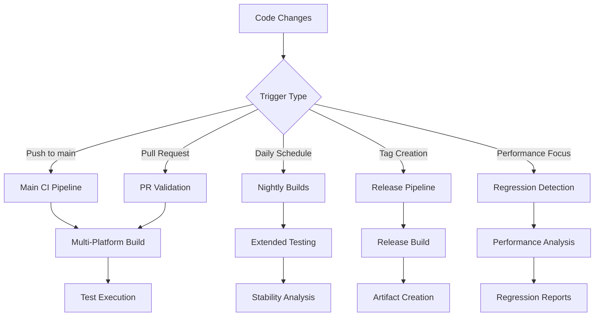

# CI/CD Workflows Reference

This document provides detailed information about the GitHub Actions workflows used in NexusSynth for continuous integration, testing, and deployment.

## Workflow Overview

NexusSynth uses a sophisticated CI/CD pipeline with five main workflows designed to ensure code quality, performance, and reliability across multiple platforms.



## Main CI Pipeline (`ci.yml`)

### Purpose
The primary continuous integration workflow that validates all code changes across multiple platforms.

### Triggers
- Push to `main` or `develop` branches
- Pull request creation and updates
- Manual workflow dispatch

### Platform Matrix
```yaml
strategy:
  fail-fast: false
  matrix:
    config:
      - name: "Windows x64 (MSVC 2022)"
        os: windows-latest
        cc: "cl"
        cxx: "cl"
        generator: "Visual Studio 17 2022"
      - name: "Ubuntu 22.04 (GCC 11)"
        os: ubuntu-22.04
        cc: "gcc-11"
        cxx: "g++-11"
      - name: "Ubuntu 22.04 (Clang 14)"
        os: ubuntu-22.04
        cc: "clang-14"
        cxx: "clang++-14"
      - name: "macOS 13 (Clang)"
        os: macos-13
        cc: "clang"
        cxx: "clang++"
      - name: "macOS ARM64 (Clang)"
        os: macos-14
        cc: "clang"
        cxx: "clang++"
```

### Key Steps
1. **Environment Setup**
   ```bash
   # Ubuntu dependencies
   sudo apt-get update
   sudo apt-get install -y build-essential cmake ninja-build libomp-dev
   
   # macOS dependencies
   brew install cmake ninja libomp
   
   # Windows MSVC setup
   uses: ilammy/msvc-dev-cmd@v1
   ```

2. **Build Configuration**
   ```bash
   cmake -B build \
     -DCMAKE_BUILD_TYPE=Release \
     -DCMAKE_C_COMPILER=${{ matrix.config.cc }} \
     -DCMAKE_CXX_COMPILER=${{ matrix.config.cxx }} \
     -DNEXUSSYNTH_BUILD_TESTS=ON \
     -DNEXUSSYNTH_BUILD_EXAMPLES=OFF
   ```

3. **Parallel Build**
   ```bash
   cmake --build build --config Release --parallel 4
   ```

4. **Test Execution**
   ```bash
   ctest --build-config Release --parallel 4 --output-on-failure
   ```

5. **Security Analysis** (Ubuntu only)
   - CodeQL analysis for security vulnerabilities
   - SARIF upload to GitHub Security tab

6. **Artifact Management**
   - Build artifacts: 30-day retention
   - Test results: 7-day retention
   - Performance data: 90-day retention

### Performance Optimization
- **Parallel Execution**: Up to 8 concurrent jobs
- **Caching**: CMake build cache and dependency cache
- **Smart Rebuilding**: Only affected components rebuilt
- **Fast Feedback**: Unit tests run before integration tests

## Pull Request Validation (`pull-request.yml`)

### Purpose
Specialized workflow for pull request validation with performance impact assessment.

### Smart Testing Strategy
```yaml
- name: Determine Changed Components
  run: |
    # Analyze changed files to determine test scope
    if [[ $CHANGED_FILES =~ "src/synthesis/" ]]; then
      echo "SYNTHESIS_TESTS=true" >> $GITHUB_ENV
    fi
    if [[ $CHANGED_FILES =~ "src/ml/" ]]; then
      echo "ML_TESTS=true" >> $GITHUB_ENV
    fi
```

### Performance Impact Assessment
```bash
# Run baseline performance comparison
./performance_benchmark_tool baseline compare \
  --baseline-branch origin/main \
  --current-branch HEAD \
  --threshold 5.0 \
  --output pr_impact_report.html
```

### PR Comment Integration
Automatic comments on pull requests with:
- Build status summary
- Test result overview
- Performance impact analysis
- Links to detailed reports

## Nightly Builds (`nightly-builds.yml`)

### Purpose
Extended testing and performance analysis with comprehensive benchmarking.

### Schedule
```yaml
schedule:
  - cron: '0 2 * * *'  # Daily at 2 AM UTC
```

### Extended Testing Features
1. **Long-Running Benchmarks**
   ```bash
   # 100+ iterations for statistical significance
   ./performance_benchmark_tool suite comprehensive \
     --iterations 100 \
     --detailed-metrics \
     --memory-profiling
   ```

2. **Stability Testing**
   ```bash
   # Continuous operation tests
   ./stability_test_runner \
     --duration 3600 \  # 1 hour
     --memory-stress \
     --thread-stress
   ```

3. **Memory Analysis**
   ```bash
   valgrind --tool=memcheck --leak-check=full \
     ./test_memory_stress
   ```

4. **Performance Trending**
   - Historical performance data collection
   - Trend analysis and prediction
   - Baseline update recommendations

### Notification System
- Slack integration for critical failures
- Email alerts for performance degradation
- GitHub issue creation for regressions

## Performance Regression Detection (`performance-regression-detection.yml`)

### Purpose
Dedicated workflow for detecting and reporting performance regressions using statistical analysis.

### Multi-Platform Benchmarking
```yaml
strategy:
  matrix:
    config:
      - { name: "Ubuntu GCC", os: ubuntu-22.04 }
      - { name: "Windows MSVC", os: windows-latest }
      - { name: "macOS Clang", os: macos-13 }
```

### Statistical Analysis Pipeline
1. **Benchmark Execution**
   ```bash
   # Comprehensive performance measurement
   ./performance_benchmark_tool suite comprehensive \
     --iterations 50 \
     --warmup 5 \
     --json --csv \
     --detailed-metrics
   ```

2. **Regression Detection**
   ```python
   # Statistical significance testing
   python .github/scripts/performance_regression_detector.py \
     --input ./performance_results \
     --database .performance_db/metrics.db \
     --baseline-days 30 \
     --create-github-issues
   ```

3. **Dashboard Generation**
   ```python
   # Interactive performance dashboard
   python .github/scripts/generate_performance_dashboard.py \
     --database .performance_db/metrics.db \
     --output ./dashboard \
     --days-back 90
   ```

### Regression Severity Classification
- **Critical**: >50% performance degradation → Immediate alert + GitHub issue
- **Major**: 25-50% degradation → GitHub issue + team notification  
- **Moderate**: 15-25% degradation → PR comment + monitoring
- **Minor**: 5-15% degradation → Logged for trending

### Database Management
```yaml
- name: Performance Database Maintenance
  run: |
    python .github/scripts/update_performance_baseline.py \
      --database .performance_db/metrics.db \
      --cleanup-old-data \
      --retain-days 365 \
      --optimize
```

## Release Pipeline (`release.yml`)

### Purpose
Automated multi-platform release builds with comprehensive validation.

### Triggers
```yaml
on:
  push:
    tags:
      - 'v*.*.*'      # e.g., v1.0.0
      - 'v*.*.*-*'    # e.g., v1.0.0-beta.1
```

### Release Build Matrix
```yaml
strategy:
  matrix:
    include:
      - os: windows-latest
        artifact: "nexussynth-windows-x64"
        archive: "zip"
      - os: ubuntu-22.04  
        artifact: "nexussynth-linux-x64"
        archive: "tar.gz"
      - os: macos-13
        artifact: "nexussynth-macos-intel"
        archive: "tar.gz"
      - os: macos-14
        artifact: "nexussynth-macos-arm64" 
        archive: "tar.gz"
```

### Validation Steps
1. **Comprehensive Testing**
   ```bash
   # Full test suite including stress tests
   ctest --parallel 4 --label-regex "unit|integration|performance"
   ```

2. **Quality Assurance**
   ```bash
   # A/B comparison with reference implementation
   ./ab_comparison_tool --config release_validation.json
   ```

3. **Performance Validation**
   ```bash
   # Ensure no performance regressions in release
   ./performance_benchmark_tool validate-release \
     --baseline-version previous-release \
     --threshold 2.0
   ```

4. **Security Scanning**
   - Binary analysis for security vulnerabilities
   - Dependency vulnerability scanning
   - Code signing (Windows/macOS)

### Release Artifact Creation
```bash
# Package release artifacts
tar -czf nexussynth-${{ github.ref_name }}-${{ matrix.artifact }}.tar.gz \
  nexussynth \
  README.md \
  LICENSE \
  docs/ \
  examples/
```

### Automatic Release Notes
- Change log generation from commits
- Performance benchmark summary
- Breaking change notifications
- Migration guides for major versions

## Workflow Configuration

### Environment Variables
```yaml
env:
  BUILD_TYPE: Release
  CMAKE_BUILD_PARALLEL_LEVEL: 4
  CTEST_PARALLEL_LEVEL: 4
  CPM_CACHE_DIR: ${{ github.workspace }}/cpm-cache
```

### Shared Actions Configuration
```yaml
# Consistent Node.js version across workflows
- uses: actions/setup-node@v4
  with:
    node-version: '18'
    cache: 'npm'

# Python environment for analysis scripts  
- uses: actions/setup-python@v5
  with:
    python-version: '3.11'
    cache: 'pip'
```

### Artifact Management Strategy
```yaml
# Build artifacts
- uses: actions/upload-artifact@v4
  with:
    name: build-artifacts-${{ matrix.config.name }}
    path: build/
    retention-days: 30

# Performance results  
- uses: actions/upload-artifact@v4
  with:
    name: performance-results-${{ matrix.config.name }}
    path: performance_results/
    retention-days: 90

# Release artifacts
- uses: actions/upload-artifact@v4  
  with:
    name: release-${{ matrix.artifact }}
    path: |
      nexussynth-*.tar.gz
      nexussynth-*.zip
    retention-days: 365
```

## Monitoring and Alerts

### GitHub Integration
- **Status Checks**: Required for PR merging
- **Branch Protection**: Enforce successful CI before merge
- **Issue Creation**: Automatic issues for critical problems

### External Notifications
```yaml
# Slack notification for failures
- uses: slackapi/slack-github-action@v1.25.0
  if: failure()
  with:
    payload: |
      {
        "text": "🚨 CI Pipeline Failed",
        "blocks": [
          {
            "type": "section",
            "text": {
              "type": "mrkdwn", 
              "text": "Workflow *${{ github.workflow }}* failed on `${{ github.ref }}`"
            }
          }
        ]
      }
```

### Performance Dashboard Deployment
```yaml
# Deploy dashboard to GitHub Pages
- uses: peaceiris/actions-gh-pages@v3
  if: github.ref == 'refs/heads/main'
  with:
    github_token: ${{ secrets.GITHUB_TOKEN }}
    publish_dir: ./performance_dashboard
    destination_dir: performance
```

## Best Practices

### Workflow Design
1. **Fail Fast**: Run quick tests first, expensive tests later
2. **Parallel Execution**: Maximize concurrent job utilization
3. **Smart Caching**: Cache dependencies and build artifacts
4. **Resource Management**: Set appropriate timeouts and limits

### Error Handling
```yaml
- name: Build with Error Recovery
  run: |
    if ! cmake --build build --parallel 4; then
      # Retry with single-threaded build
      echo "Parallel build failed, retrying with single thread"
      cmake --build build --parallel 1
    fi
```

### Security Considerations
```yaml
# Never expose secrets in logs
- name: Secure Operations
  env:
    API_KEY: ${{ secrets.API_KEY }}
  run: |
    # Use environment variables for sensitive data
    echo "API Key length: ${#API_KEY}" # Safe to log
    # NEVER: echo "API Key: $API_KEY" # Dangerous!
```

### Performance Optimization
- Use GitHub-hosted runners efficiently
- Implement smart test selection
- Cache build dependencies
- Optimize artifact sizes

## Troubleshooting Workflows

### Common Issues
1. **Build Timeouts**: Increase timeout or optimize build
2. **Flaky Tests**: Implement retry mechanisms
3. **Resource Limits**: Monitor runner resource usage
4. **Dependency Issues**: Pin specific versions

### Debugging Strategies
```bash
# Enable verbose output
ctest --verbose --parallel 1

# Debug CMake configuration
cmake -B build --debug-output

# Check runner environment  
printenv | grep -E "(GITHUB|CI|RUNNER)"
```

### Local Testing
```bash
# Simulate CI environment locally
docker run --rm -it -v $(pwd):/workspace ubuntu:22.04
cd /workspace
# Run same commands as CI
```

---

*This workflow documentation is maintained by the NexusSynth development team. For questions or issues, please create a GitHub issue or discussion.*