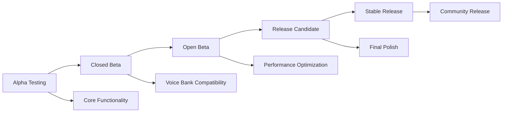

# Community Testing Guide

Welcome to the NexusSynth community testing program! This guide will help beta testers contribute to the development of the next-generation vocal synthesis resampler for UTAU.

## Table of Contents

1. [Getting Started](#getting-started)
2. [Testing Requirements](#testing-requirements)
3. [Installation and Setup](#installation-and-setup)
4. [Testing Scenarios](#testing-scenarios)
5. [Quality Assessment](#quality-assessment)
6. [Performance Testing](#performance-testing)
7. [Reporting Issues](#reporting-issues)
8. [Community Guidelines](#community-guidelines)
9. [Advanced Testing](#advanced-testing)
10. [FAQ](#faq)

## Getting Started

### What is NexusSynth?

NexusSynth is a next-generation vocal synthesis resampler designed as a drop-in replacement for existing UTAU resamplers. It combines:

- **WORLD Vocoder**: Advanced spectral analysis for high-quality parameter extraction
- **HMM-based Statistical Modeling**: Intelligent voice modeling for natural synthesis
- **Pulse-by-Pulse Synthesis**: Real-time synthesis with superior quality
- **Advanced Pitch Handling**: Eliminates "chipmunk effect" in extreme pitch ranges

### Beta Testing Goals

Our community testing program aims to:

1. **Quality Validation**: Ensure NexusSynth produces high-quality vocal synthesis
2. **Performance Verification**: Confirm real-time performance across different systems
3. **Compatibility Testing**: Validate compatibility with existing UTAU projects and voice banks
4. **User Experience**: Gather feedback on workflow integration and usability
5. **Edge Case Discovery**: Find and fix issues with unusual configurations or voice banks

### Testing Phases



**Current Phase**: Open Beta - We're looking for community feedback on compatibility and performance!

## Testing Requirements

### System Requirements

#### Minimum Requirements
- **OS**: Windows 10 (64-bit), Ubuntu 20.04+, macOS 11+
- **CPU**: Intel Core i5-4590 or AMD FX-8350 equivalent
- **RAM**: 4 GB RAM
- **Storage**: 1 GB available space
- **Audio**: DirectSound/ASIO compatible audio device

#### Recommended Requirements
- **OS**: Windows 11, Ubuntu 22.04, macOS 13+
- **CPU**: Intel Core i7-8700K or AMD Ryzen 7 2700X or better
- **RAM**: 8 GB RAM or more
- **Storage**: 2 GB available space (SSD recommended)
- **Audio**: ASIO-compatible audio interface

### Software Dependencies

#### UTAU Environment
- **UTAU**: Version 0.4.18e or later
- **Voice Banks**: At least 3 different voice banks for testing
- **Projects**: Existing UTAU projects for compatibility testing

#### Testing Tools (Optional but Helpful)
- **Audio Editor**: Audacity, Reaper, or similar for quality assessment
- **Spectrum Analyzer**: For detailed audio analysis
- **System Monitor**: To track performance metrics

### Testing Voice Banks

We recommend testing with diverse voice bank types:

#### Essential Voice Bank Categories
1. **Japanese VCV**: Standard Japanese voice bank
2. **English ARPASING**: English phoneme voice bank  
3. **Multilingual**: Voice banks supporting multiple languages
4. **Special Types**: Whisper, growl, or other unique voice types

#### Recommended Test Voice Banks
- **Freely Available Voice Banks**:
  - Uta (Japanese VCV) - Basic testing
  - Teto (Japanese VCV/English) - Cross-language testing
  - Community voice banks - Compatibility testing

*Note: Please respect voice bank licenses and only use legally obtained voice banks.*

## Installation and Setup

### Binary Installation (Recommended for Beta Testers)

1. **Download Latest Beta**:
   ```
   Visit: https://github.com/nexussynth/nexussynth/releases
   Download: nexussynth-beta-[platform].zip
   ```

2. **Extract and Install**:
   ```bash
   # Windows
   Extract to C:\Program Files\NexusSynth\
   
   # Linux
   sudo tar -xzf nexussynth-beta-linux.tar.gz -C /opt/
   
   # macOS
   sudo tar -xzf nexussynth-beta-macos.tar.gz -C /Applications/
   ```

3. **Configure UTAU**:
   - Open UTAU preferences
   - Set resampler path to NexusSynth executable
   - Enable advanced resampler features if available

### Source Build (Advanced Users)

```bash
# Clone repository
git clone https://github.com/nexussynth/nexussynth.git
cd nexussynth

# Build with beta features
mkdir build && cd build
cmake .. -DCMAKE_BUILD_TYPE=Release -DNEXUSSYNTH_BETA_FEATURES=ON
make -j$(nproc)

# Install
sudo make install
```

### Verification

Verify your installation:

```bash
# Test basic functionality
./nexussynth --version
./nexussynth --test-synthesis

# Performance check
./nexussynth --benchmark-quick
```

Expected output:
```
NexusSynth v0.9.0-beta.2 (Build: 2025-08-20)
Core functionality: OK
WORLD vocoder: OK  
HMM models: OK
Quick benchmark: ~15ms average synthesis time
```

## Testing Scenarios

### Basic Functionality Tests

#### 1. Single Note Synthesis
**Objective**: Verify basic synthesis capability

**Steps**:
1. Open UTAU with a simple one-note project
2. Set NexusSynth as the resampler
3. Render the project
4. Listen for:
   - Clear vocal output
   - Correct pitch
   - No artifacts or distortion

**Expected Results**:
- Clean, natural-sounding vocal synthesis
- Accurate pitch matching
- No clicks, pops, or digital artifacts

#### 2. Scale Synthesis  
**Objective**: Test pitch accuracy across ranges

**Steps**:
1. Create a chromatic scale project (C4 to C6)
2. Use the same phoneme for all notes (e.g., "a")
3. Render and analyze pitch accuracy
4. Compare with reference resampler

**Quality Checks**:
- Pitch accuracy within ±5 cents
- Consistent timbre across range
- No "chipmunk effect" at high pitches
- No formant distortion at low pitches

#### 3. Phoneme Transitions
**Objective**: Evaluate phoneme boundary handling

**Steps**:
1. Create phrases with various phoneme combinations
2. Focus on challenging transitions (vowel-consonant, consonant-consonant)
3. Render and listen for smooth transitions
4. Use spectrum analysis to verify formant continuity

**Test Phrases** (adjust for voice bank language):
- Japanese: "arigatou gozaimasu"
- English: "the quick brown fox"
- Challenging: "strength" (str-e-ng-th)

### Advanced Testing Scenarios

#### 4. Performance Stress Tests
**Objective**: Evaluate performance under load

**Test Cases**:
- **Long Projects**: 3+ minute songs with complex arrangements
- **Dense Harmonies**: Multiple vocal parts simultaneously
- **Rapid Passages**: Fast-paced vocal lines with quick phoneme changes
- **Extreme Pitches**: Very high (C6+) and very low (C3-) notes

**Metrics to Monitor**:
- Rendering time vs. audio length
- Memory usage during processing
- CPU usage patterns
- Audio dropouts or real-time issues

#### 5. Voice Bank Compatibility
**Objective**: Ensure broad voice bank support

**Test Matrix**:
| Voice Bank Type | Japanese | English | Other Languages |
|----------------|----------|---------|-----------------|
| CV | ✓ Test | N/A | ✓ Test |
| VCV | ✓ Test | ✓ Test | ✓ Test |  
| CVVC | ✓ Test | ✓ Test | ✓ Test |
| VCCV | N/A | ✓ Test | ✓ Test |
| ARPASING | N/A | ✓ Test | N/A |

**Per Voice Bank Tests**:
1. Basic phoneme coverage
2. Special samples (breath, vocal fry, etc.)
3. Pitch range limits
4. Oto.ini parameter handling

#### 6. UTAU Integration Tests
**Objective**: Validate seamless UTAU integration

**Integration Points**:
- **Flag Support**: Test all UTAU flags (g, P, Mt, etc.)
- **Envelope Processing**: Verify envelope application
- **Tempo Changes**: Test with variable tempo projects
- **Plugin Compatibility**: Test with common UTAU plugins

### Edge Case Testing

#### 7. Unusual Configurations
**Test Scenarios**:
- Very short notes (<100ms duration)
- Very long sustained notes (>10 seconds)
- Extreme pitch bends (>2 octaves)
- Complex flag combinations
- Non-standard sample rates
- Voice banks with unusual oto.ini configurations

#### 8. Error Handling
**Test Invalid Inputs**:
- Corrupted voice bank files
- Missing audio samples
- Invalid oto.ini entries
- Unsupported file formats
- Memory-constrained systems

## Quality Assessment

### Objective Quality Metrics

#### Audio Quality Analysis Tools
1. **Spectrum Analysis**:
   ```bash
   # Use NexusSynth's built-in analysis
   ./nexussynth --analyze-quality input.wav reference.wav
   
   # Or use external tools
   # Audacity: Analyze > Plot Spectrum
   # FFmpeg: ffmpeg -i input.wav -af showspectrumpic=s=1024x512 spectrum.png
   ```

2. **SNR Calculation**:
   ```python
   # Python script for SNR calculation
   import librosa
   import numpy as np
   
   def calculate_snr(reference, test):
       signal_power = np.mean(reference ** 2)
       noise_power = np.mean((test - reference) ** 2)
       snr_db = 10 * np.log10(signal_power / noise_power)
       return snr_db
   ```

#### Quality Benchmarks
- **SNR Target**: >40 dB compared to original samples
- **THD Target**: <1% total harmonic distortion
- **Formant Accuracy**: <5% deviation from reference
- **Pitch Accuracy**: ±3 cents maximum deviation

### Subjective Quality Assessment

#### Listening Test Protocol
1. **Blind Comparison**:
   - Render the same phrase with NexusSynth and reference resampler
   - Use audio randomization to prevent bias
   - Rate on 1-10 scale for naturalness, clarity, and artifacts

2. **Quality Dimensions**:
   - **Naturalness**: How human-like does the voice sound?
   - **Clarity**: Is the pronunciation clear and intelligible?
   - **Consistency**: Does timbre remain consistent across notes?
   - **Artifacts**: Are there any digital artifacts or glitches?

3. **Rating Scale**:
   - 9-10: Excellent, indistinguishable from professional vocal
   - 7-8: Very good, minor artifacts only
   - 5-6: Good, noticeable but acceptable artifacts  
   - 3-4: Fair, significant issues but usable
   - 1-2: Poor, major issues affecting usability

#### Comparative Testing Template

| Test Scenario | NexusSynth Rating | Reference Rating | Notes |
|---------------|-------------------|------------------|-------|
| Basic Phonemes | ___/10 | ___/10 | |
| Pitch Range | ___/10 | ___/10 | |
| Transitions | ___/10 | ___/10 | |
| Performance | ___/10 | ___/10 | |
| **Overall** | **___/10** | **___/10** | |

## Performance Testing

### Rendering Performance

#### Benchmarking Procedure
1. **Prepare Test Projects**:
   - Short phrase (10 seconds)
   - Medium song (1 minute)
   - Long project (3+ minutes)

2. **Measure Rendering Time**:
   ```bash
   # Time the rendering process
   time ./nexussynth --render project.ust output.wav
   
   # Or use UTAU's built-in timing
   # Note rendering start/end times in UTAU
   ```

3. **Calculate Performance Ratio**:
   ```
   Performance Ratio = Audio Duration / Rendering Time
   
   Example: 60-second audio rendered in 20 seconds = 3.0x real-time
   ```

#### Performance Targets
- **Minimum Acceptable**: 1.0x real-time (60s audio in ≤60s)
- **Good Performance**: 2.0x real-time (60s audio in ≤30s)  
- **Excellent Performance**: 4.0x real-time (60s audio in ≤15s)

### Memory Usage Monitoring

#### Windows Performance Monitoring
```powershell
# Monitor NexusSynth process
Get-Process nexussynth | Select-Object Name, CPU, WorkingSet, VirtualMemorySize

# Or use Performance Monitor
perfmon /rel
```

#### Linux/macOS Monitoring
```bash
# Monitor memory usage
top -p $(pgrep nexussynth)

# Detailed memory analysis  
ps aux | grep nexussynth
pmap $(pgrep nexussynth)

# Memory usage over time
while true; do
    ps -o pid,vsz,rss,comm -p $(pgrep nexussynth)
    sleep 5
done
```

#### Memory Usage Targets
- **Idle Memory**: <100 MB
- **Active Synthesis**: <500 MB for typical projects
- **Large Projects**: <1 GB for complex, multi-part arrangements
- **Memory Leaks**: No continuous memory growth during idle periods

## Reporting Issues

### Issue Categories

#### 1. Critical Issues (Report Immediately)
- **Crashes**: Application crashes or system instability
- **Data Loss**: Corruption of projects or voice banks
- **Security Issues**: Suspicious behavior or security concerns

#### 2. High Priority Issues
- **Functional Failures**: Core features not working
- **Quality Issues**: Significant audio quality problems
- **Performance Issues**: Unacceptable rendering times or resource usage

#### 3. Medium Priority Issues  
- **Compatibility Problems**: Issues with specific voice banks or UTAU versions
- **Minor Quality Issues**: Subtle audio artifacts or inconsistencies
- **Usability Issues**: Confusing behavior or workflow problems

#### 4. Low Priority Issues
- **Enhancement Requests**: Suggestions for new features
- **Documentation Issues**: Unclear or missing documentation
- **Minor Bugs**: Small issues that don't affect core functionality

### Bug Report Template

When reporting issues, please use this template:

```markdown
## Bug Report

### Environment Information
- **OS**: Windows 11 Pro (Build 22000.1936)
- **NexusSynth Version**: v0.9.0-beta.2
- **UTAU Version**: 0.4.18e
- **Voice Bank**: Teto VCV (Version X.X)

### Issue Description
Brief description of the problem...

### Steps to Reproduce
1. Open UTAU with NexusSynth as resampler
2. Load voice bank: Teto VCV
3. Create note: C4, phoneme "a", 500ms duration
4. Render project
5. Issue occurs: [describe what happens]

### Expected Behavior  
What should happen instead...

### Actual Behavior
What actually happens...

### Audio Examples
If applicable, attach:
- Input UTAU project file (.ust)
- Output audio file showing the issue
- Reference audio from other resampler (for comparison)

### System Performance
- CPU Usage during issue: X%
- Memory Usage: X MB
- Rendering Time: X seconds for Y seconds of audio

### Additional Context
Any other relevant information...

### Severity Assessment
- [ ] Critical (crashes, data loss)
- [x] High (major functionality issues)
- [ ] Medium (compatibility or minor quality issues)  
- [ ] Low (enhancement requests, minor bugs)

### Workaround
If you found a temporary workaround, please describe it...
```

### Reporting Channels

#### GitHub Issues (Primary)
- **URL**: https://github.com/nexussynth/nexussynth/issues
- **Use For**: All bug reports and feature requests
- **Response Time**: Typically 24-48 hours

#### Community Discord (Secondary)
- **Invite**: [Discord Invite Link]
- **Use For**: Quick questions, discussion, and initial troubleshooting
- **Beta Testing Channel**: #beta-testing

#### Email (Critical Issues Only)
- **Address**: beta-testing@nexussynth.org
- **Use For**: Security issues, urgent bugs, or private concerns
- **Response Time**: 24 hours for critical issues

## Community Guidelines

### Code of Conduct

#### Our Commitment
We are committed to providing a welcoming and inclusive environment for all contributors, regardless of experience level, background, or identity.

#### Expected Behavior
- **Be Respectful**: Treat all community members with respect and courtesy
- **Be Constructive**: Provide helpful, actionable feedback
- **Be Patient**: Remember that development takes time and testing is iterative
- **Be Collaborative**: Work together to improve NexusSynth for everyone

#### Unacceptable Behavior
- Harassment, discrimination, or personal attacks
- Spamming or off-topic discussions
- Sharing of copyrighted voice banks without permission
- Deliberate spreading of misinformation

### Testing Best Practices

#### Quality Testing
1. **Test Systematically**: Follow the testing scenarios in order
2. **Document Everything**: Keep detailed notes of your testing process
3. **Compare Fairly**: Use appropriate reference points for comparison
4. **Report Accurately**: Provide precise, factual descriptions of issues

#### Community Collaboration
1. **Share Knowledge**: Help other testers with technical issues
2. **Avoid Duplication**: Check existing issues before reporting new ones
3. **Provide Context**: Include relevant system information and test conditions
4. **Follow Up**: Respond to developer questions about your reports

### Recognition and Rewards

#### Beta Tester Recognition
- **Credits**: Beta testers will be acknowledged in release notes and documentation
- **Early Access**: Priority access to future beta versions and features
- **Community Status**: Special recognition in community spaces

#### Contribution Levels
- **Bronze Tester**: 5+ quality bug reports or test results
- **Silver Tester**: 15+ contributions plus community help
- **Gold Tester**: 30+ contributions plus significant quality improvements
- **Platinum Tester**: Exceptional contributions to project success

## Advanced Testing

### Custom Test Scenarios

#### Creating Your Own Tests
```python
# Example Python script for custom testing
import subprocess
import time
import os

def test_custom_scenario(voice_bank, test_phrase, expected_duration):
    """Test a custom synthesis scenario."""
    
    # Generate UTAU project file
    project_file = create_ust_project(voice_bank, test_phrase)
    
    # Measure synthesis time
    start_time = time.time()
    result = subprocess.run([
        'nexussynth',
        '--render', project_file,
        '--output', 'test_output.wav'
    ], capture_output=True, text=True)
    end_time = time.time()
    
    # Calculate metrics
    synthesis_time = end_time - start_time
    performance_ratio = expected_duration / synthesis_time
    
    return {
        'success': result.returncode == 0,
        'synthesis_time': synthesis_time,
        'performance_ratio': performance_ratio,
        'output': result.stdout,
        'errors': result.stderr
    }

# Run custom test
result = test_custom_scenario('teto_vcv', 'arigatou', 2.5)
print(f"Performance: {result['performance_ratio']:.2f}x real-time")
```

#### Automated Testing Scripts
```bash
#!/bin/bash
# Automated compatibility testing script

VOICE_BANKS=("teto_vcv" "miku_english" "utau_default")  
TEST_PHRASES=("hello world" "arigatou" "test phrase")

for bank in "${VOICE_BANKS[@]}"; do
    for phrase in "${TEST_PHRASES[@]}"; do
        echo "Testing: $bank with '$phrase'"
        
        # Create test project
        ./create_test_project.py --bank "$bank" --phrase "$phrase" --output "test_${bank}_${phrase}.ust"
        
        # Render with NexusSynth
        time ./nexussynth --render "test_${bank}_${phrase}.ust" --output "output_${bank}_${phrase}.wav"
        
        # Analyze quality
        ./analyze_quality.py "output_${bank}_${phrase}.wav" >> "quality_results.txt"
        
        echo "Completed: $bank with '$phrase'"
        echo "---"
    done
done

echo "All tests completed. Results in quality_results.txt"
```

### Performance Profiling

#### Advanced Performance Analysis
```bash
# CPU profiling with perf (Linux)
perf record -g ./nexussynth --render test_project.ust output.wav
perf report

# Memory profiling with Valgrind
valgrind --tool=massif ./nexussynth --render test_project.ust output.wav
ms_print massif.out.*

# Windows Performance Profiler
# Use Windows Performance Toolkit (WPT) for detailed analysis
```

#### Custom Benchmarking
```cpp
// C++ benchmarking code for advanced users
#include <chrono>
#include <nexussynth/synthesis_engine.h>

class CustomBenchmark {
public:
    void benchmark_synthesis_pipeline() {
        auto start = std::chrono::high_resolution_clock::now();
        
        // Custom synthesis test
        SynthesisEngine engine;
        engine.initialize();
        
        for (int i = 0; i < 100; ++i) {
            auto result = engine.synthesize_phoneme("a", 440.0, 500);
            // Process result...
        }
        
        auto end = std::chrono::high_resolution_clock::now();
        auto duration = std::chrono::duration_cast<std::chrono::milliseconds>(end - start);
        
        std::cout << "100 phoneme synthesis took: " << duration.count() << "ms" << std::endl;
    }
};
```

## FAQ

### General Questions

**Q: How is NexusSynth different from existing resamplers?**
A: NexusSynth uses modern WORLD vocoder technology combined with HMM statistical modeling for higher quality synthesis. It's designed to eliminate common issues like the "chipmunk effect" at extreme pitches while maintaining real-time performance.

**Q: Will NexusSynth work with my existing UTAU projects?**  
A: Yes! NexusSynth is designed as a drop-in replacement for existing resamplers. Your existing projects and voice banks should work without modification.

**Q: Is NexusSynth free to use?**
A: NexusSynth will be released under an open-source license, making it free for all users including commercial use.

### Technical Questions

**Q: What voice bank formats are supported?**
A: NexusSynth supports all standard UTAU voice bank formats including CV, VCV, CVVC, VCCV, and ARPASING. Special formats and multilingual voice banks are also supported.

**Q: How much better is the performance compared to other resamplers?**
A: Performance varies by system, but typical improvements are 2-4x faster than traditional resamplers while maintaining higher quality output.

**Q: Can I use NexusSynth with real-time UTAU playback?**
A: Yes, NexusSynth is optimized for real-time performance and should work well with UTAU's real-time playback features.

### Testing Questions  

**Q: I found a bug, but I'm not sure if it's critical. How should I report it?**
A: When in doubt, report it! Use the severity assessment in the bug report template. We'd rather receive duplicate reports than miss important issues.

**Q: Can I test NexusSynth with copyrighted voice banks?**
A: Only test with voice banks you legally own or have permission to use. Many high-quality free voice banks are available for testing.

**Q: How long does beta testing typically last?**
A: Beta testing phases typically last 2-4 weeks each, depending on the issues discovered and feedback received.

### Troubleshooting

**Q: NexusSynth crashes when I try to render. What should I do?**
A: First, check system requirements and try with a simpler project. If the issue persists, report it as a critical bug with complete system information and steps to reproduce.

**Q: The audio quality seems worse than my current resampler. Is this normal?**  
A: This shouldn't happen with properly configured NexusSynth. Please report this as a high-priority issue with audio examples for comparison.

**Q: NexusSynth is much slower than expected. How can I improve performance?**
A: Check that you're using a release build (not debug), ensure adequate RAM is available, and close unnecessary applications. If issues persist, report performance data.

---

**Thank you for participating in NexusSynth beta testing!** Your feedback is invaluable in making NexusSynth the best vocal synthesis solution for the UTAU community.

*For questions about this testing guide or the beta program, please contact the development team through our GitHub issues or Discord server.*