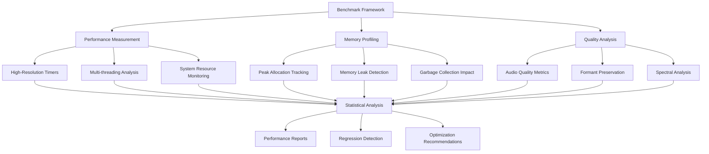

# Performance Benchmarking Guide

This guide provides comprehensive documentation for NexusSynth's performance benchmarking system, including measurement methodologies, analysis tools, and interpretation of results.

## Overview

NexusSynth's performance benchmarking framework is designed to provide accurate, reproducible measurements of synthesis engine performance across multiple platforms and scenarios. The system emphasizes statistical rigor and practical insights for optimization.

## Benchmarking Architecture

### Core Components



### Framework Structure

```cpp
// Core benchmarking classes
class PerformanceBenchmark {
public:
    struct BenchmarkConfig {
        int iterations = 50;
        int warmup_iterations = 5;
        bool enable_memory_profiling = true;
        bool enable_quality_analysis = true;
        std::chrono::seconds timeout{300};
    };
    
    BenchmarkResult run_benchmark_suite(BenchmarkSuite suite, const BenchmarkConfig& config);
    void generate_report(const std::vector<BenchmarkResult>& results);
};

class PerformanceMeasurement {
public:
    void start_timing();
    std::chrono::nanoseconds end_timing();
    MemorySnapshot take_memory_snapshot();
    ThreadPerformanceData analyze_thread_performance();
};
```

## Available Benchmark Suites

### 1. Comprehensive Suite (`comprehensive`)

The most thorough benchmark covering all major components:

#### WORLD Analysis Benchmarks
- **F0 Extraction**: Fundamental frequency estimation performance
- **Spectral Parameter Analysis**: Spectral envelope calculation
- **Aperiodicity Analysis**: Noise component analysis
- **Parameter Validation**: Quality checking of extracted parameters

```cpp
// Example WORLD Analysis benchmark
void benchmark_world_analysis() {
    AudioBuffer input_audio = load_test_audio("benchmark_sample.wav");
    
    auto start = std::chrono::high_resolution_clock::now();
    WorldParameters params = extract_world_parameters(input_audio);
    auto end = std::chrono::high_resolution_clock::now();
    
    auto duration = std::chrono::duration_cast<std::chrono::nanoseconds>(end - start);
    record_benchmark_result("WORLD_Analysis", duration, get_memory_usage());
}
```

#### HMM Training Benchmarks
- **Model Initialization**: Setup time for statistical models
- **Parameter Estimation**: EM algorithm convergence speed
- **Context Feature Processing**: Linguistic feature extraction
- **Model Optimization**: Final model refinement

#### MLPG Generation Benchmarks
- **Parameter Trajectory Optimization**: Maximum likelihood parameter generation
- **Constraint Application**: Duration and continuity constraints
- **Variance Processing**: Global variance handling
- **Output Smoothing**: Trajectory smoothing algorithms

#### Pulse-by-Pulse Synthesis Benchmarks
- **Waveform Generation**: Core synthesis loop performance
- **Real-time Processing**: Streaming synthesis capabilities
- **Quality Enhancement**: Post-processing and filtering
- **Memory Management**: Buffer allocation and cleanup

### 2. Basic Suite (`basic`)

Lightweight benchmark for quick performance checks:
- Essential WORLD operations
- Core synthesis functionality
- Memory usage basics
- Single-threaded performance

### 3. Memory Profiling Suite (`memory`)

Focused on memory usage patterns:
- Peak allocation measurement
- Memory leak detection
- Fragmentation analysis
- Cache performance impact

### 4. Threading Suite (`threading`)

Multi-threading performance analysis:
- Thread scalability testing
- Lock contention measurement
- Parallel efficiency analysis
- NUMA topology impact

## Benchmark Execution

### Command-Line Interface

The `performance_benchmark_tool` provides comprehensive benchmarking capabilities:

#### Basic Execution
```bash
# Run comprehensive benchmark suite
./performance_benchmark_tool suite comprehensive

# Quick performance check
./performance_benchmark_tool suite basic --iterations 10

# Memory-focused analysis
./performance_benchmark_tool suite memory --detailed-memory-tracking
```

#### Advanced Options
```bash
# Full configuration with detailed output
./performance_benchmark_tool suite comprehensive \
    --iterations 100 \
    --warmup 10 \
    --output ./benchmark_results \
    --json --csv --html \
    --detailed-metrics \
    --include-environment-info \
    --memory-profiling \
    --thread-analysis \
    --quality-validation \
    --timeout 600
```

#### Batch Processing
```bash
# Run multiple benchmark configurations
./performance_benchmark_tool batch \
    --config benchmark_configs.json \
    --parallel-execution \
    --output-format json
```

### Configuration Files

JSON configuration for reproducible benchmarking:

```json
{
  "benchmark_config": {
    "name": "comprehensive_benchmark",
    "description": "Full performance analysis",
    "iterations": 50,
    "warmup_iterations": 5,
    "timeout_seconds": 300,
    "platforms": ["linux", "windows", "macos"],
    "output": {
      "formats": ["json", "csv", "html"],
      "detailed_metrics": true,
      "include_environment": true
    },
    "suites": [
      {
        "name": "comprehensive",
        "components": [
          "world_analysis",
          "hmm_training", 
          "mlpg_generation",
          "pbp_synthesis"
        ],
        "memory_profiling": true,
        "thread_analysis": true,
        "quality_validation": true
      }
    ]
  }
}
```

### Environment Configuration

```bash
# Set performance-friendly environment
export OMP_NUM_THREADS=4
export OMP_PROC_BIND=true
export MALLOC_CONF="prof:true,prof_active:false"

# Disable frequency scaling for consistent results
echo performance | sudo tee /sys/devices/system/cpu/cpu*/cpufreq/scaling_governor

# Set process priority
nice -n -10 ./performance_benchmark_tool suite comprehensive
```

## Performance Metrics

### Timing Measurements

#### High-Resolution Timing
```cpp
class PrecisionTimer {
public:
    void start() {
        start_time_ = std::chrono::high_resolution_clock::now();
    }
    
    std::chrono::nanoseconds elapsed() {
        auto end_time = std::chrono::high_resolution_clock::now();
        return std::chrono::duration_cast<std::chrono::nanoseconds>(
            end_time - start_time_);
    }
    
private:
    std::chrono::high_resolution_clock::time_point start_time_;
};
```

#### Statistical Analysis
- **Mean Execution Time**: Average performance across iterations
- **Standard Deviation**: Performance consistency measurement
- **95th Percentile**: Worst-case performance bounds
- **Coefficient of Variation**: Relative performance stability

### Memory Metrics

#### Memory Usage Tracking
```cpp
struct MemorySnapshot {
    size_t virtual_memory_size;      // Total virtual memory
    size_t resident_set_size;        // Physical memory in use
    size_t peak_allocation;          // Maximum allocation during run
    size_t total_allocations;        // Number of allocations
    size_t total_deallocations;      // Number of deallocations
    double fragmentation_ratio;      // Memory fragmentation level
};
```

#### Memory Analysis
- **Peak Usage**: Maximum memory consumption
- **Working Set**: Active memory footprint
- **Allocation Patterns**: Memory usage over time
- **Leak Detection**: Unreleased memory identification

### Quality Metrics

#### Audio Quality Assessment
```cpp
class QualityMetrics {
public:
    double calculate_snr(const AudioBuffer& reference, const AudioBuffer& test);
    double calculate_thd(const AudioBuffer& audio);  // Total harmonic distortion
    double calculate_formant_deviation(const AudioBuffer& original, 
                                     const AudioBuffer& processed);
    double calculate_spectral_centroid_shift(const AudioBuffer& audio);
};
```

#### Performance vs Quality Trade-offs
- **Quality Score**: Composite audio quality rating (0-1)
- **Formant Preservation**: Spectral accuracy measurement
- **Harmonic Distortion**: Audio fidelity assessment
- **Processing Latency**: Real-time capability measurement

### System Resource Metrics

#### CPU Performance
- **CPU Utilization**: Processor usage percentage
- **Core Distribution**: Multi-core usage patterns
- **Cache Performance**: L1/L2/L3 cache hit rates
- **Context Switches**: Thread switching overhead

#### I/O Performance
- **Disk I/O**: File system access patterns
- **Network I/O**: Data transfer performance
- **Memory Bandwidth**: RAM access efficiency

## Benchmark Results Interpretation

### Performance Baseline

Reference performance targets for different scenarios:

| Component | Target Time (ms) | Acceptable Range | Platform Notes |
|-----------|------------------|------------------|----------------|
| WORLD Analysis (1s audio) | 45.2 | 40-55 | Ubuntu GCC-11 |
| HMM Training (100 params) | 128.7 | 110-150 | 4-core system |
| MLPG Generation | 32.1 | 28-40 | Single-threaded |
| PbP Synthesis (1s) | 15.8 | 12-20 | Real-time target |

### Performance Classes

#### Excellent Performance (Green)
- Execution time < baseline - 15%
- Memory usage < baseline - 10%
- Quality score > 0.95

#### Good Performance (Yellow)  
- Execution time within ±15% of baseline
- Memory usage within ±20% of baseline
- Quality score > 0.85

#### Poor Performance (Red)
- Execution time > baseline + 25%
- Memory usage > baseline + 30%
- Quality score < 0.85

### Regression Analysis

#### Statistical Significance Testing
```python
def detect_performance_regression(baseline_data, current_data, alpha=0.05):
    """Detect statistically significant performance changes."""
    
    # One-sample t-test against baseline mean
    baseline_mean = np.mean(baseline_data)
    t_stat, p_value = stats.ttest_1samp(current_data, baseline_mean)
    
    # Calculate effect size (Cohen's d)
    pooled_std = np.sqrt(((len(baseline_data) - 1) * np.var(baseline_data, ddof=1) +
                         (len(current_data) - 1) * np.var(current_data, ddof=1)) /
                        (len(baseline_data) + len(current_data) - 2))
    
    cohens_d = (np.mean(current_data) - baseline_mean) / pooled_std
    
    # Determine significance and practical importance
    is_significant = p_value < alpha
    is_large_effect = abs(cohens_d) > 0.8  # Large effect size
    
    return {
        'p_value': p_value,
        'cohens_d': cohens_d,
        'is_significant': is_significant,
        'is_practically_significant': is_significant and is_large_effect
    }
```

#### Regression Severity Classification
- **Critical**: >50% performance degradation, p < 0.001
- **Major**: 25-50% degradation, p < 0.01
- **Moderate**: 15-25% degradation, p < 0.05
- **Minor**: 5-15% degradation, statistically significant

## Report Generation

### HTML Reports

Comprehensive HTML reports with interactive visualizations:

```html
<!-- Example report structure -->
<!DOCTYPE html>
<html>
<head>
    <title>NexusSynth Performance Benchmark Report</title>
    <script src="https://cdn.plot.ly/plotly-latest.min.js"></script>
</head>
<body>
    <h1>Performance Benchmark Results</h1>
    
    <div id="execution-time-chart"></div>
    <div id="memory-usage-chart"></div>
    <div id="quality-metrics-chart"></div>
    
    <table id="detailed-results">
        <tr>
            <th>Benchmark</th>
            <th>Mean Time (ms)</th>
            <th>Std Dev (ms)</th>
            <th>Peak Memory (MB)</th>
            <th>Quality Score</th>
        </tr>
        <!-- Results populated dynamically -->
    </table>
</body>
</html>
```

### CSV Export

Machine-readable format for data analysis:

```csv
timestamp,benchmark_name,platform,iteration,execution_time_ns,memory_usage_bytes,quality_score,cpu_usage_percent
2025-08-20T14:30:00Z,WORLD_Analysis,Ubuntu_GCC,1,45234567,67108864,0.94,78.5
2025-08-20T14:30:01Z,WORLD_Analysis,Ubuntu_GCC,2,44987543,67174400,0.95,79.2
```

### JSON Format

Structured data for programmatic processing:

```json
{
  "benchmark_session": {
    "timestamp": "2025-08-20T14:30:00Z",
    "platform": {
      "os": "Linux",
      "arch": "x86_64",
      "compiler": "GCC 11.3.0",
      "cpu_model": "Intel Core i7-9700K",
      "memory_total": 16777216,
      "core_count": 8
    },
    "configuration": {
      "iterations": 50,
      "warmup_iterations": 5,
      "timeout_seconds": 300
    },
    "results": [
      {
        "benchmark_name": "WORLD_Analysis",
        "statistics": {
          "mean_time_ns": 45123456,
          "std_dev_ns": 2345678,
          "percentile_95_ns": 48765432,
          "min_time_ns": 42345678,
          "max_time_ns": 51234567
        },
        "memory": {
          "peak_usage_bytes": 67108864,
          "average_usage_bytes": 65536000,
          "allocations": 156,
          "deallocations": 156
        },
        "quality": {
          "average_score": 0.947,
          "formant_preservation": 0.923,
          "spectral_accuracy": 0.967
        }
      }
    ]
  }
}
```

## Optimization Strategies

### Performance Tuning Guidelines

#### 1. Algorithm Optimization
```cpp
// Before: Inefficient nested loops
for (int i = 0; i < n; ++i) {
    for (int j = 0; j < m; ++j) {
        result += expensive_function(data[i], data[j]);
    }
}

// After: Vectorized operations
const auto vectorized_data = vectorize(data);
result = dot_product(vectorized_data, vectorized_data);
```

#### 2. Memory Access Patterns
```cpp
// Cache-friendly data structures
struct AlignedData {
    alignas(64) float data[16];  // Cache line alignment
};

// Prefetch for better memory performance
void process_data(const std::vector<float>& input) {
    for (size_t i = 0; i < input.size(); ++i) {
        if (i + 64 < input.size()) {
            __builtin_prefetch(&input[i + 64], 0, 3);
        }
        // Process input[i]
    }
}
```

#### 3. Parallel Processing
```cpp
// OpenMP parallelization
#pragma omp parallel for reduction(+:sum)
for (int i = 0; i < n; ++i) {
    sum += compute_intensive_function(data[i]);
}
```

### Platform-Specific Optimizations

#### Linux/GCC Optimizations
```bash
# Compiler flags for maximum performance
CXXFLAGS="-O3 -march=native -mtune=native -flto -ffast-math"
CXXFLAGS="$CXXFLAGS -funroll-loops -fprefetch-loop-arrays"

# Runtime optimizations
export OMP_PROC_BIND=spread
export OMP_PLACES=cores
export MALLOC_MMAP_THRESHOLD_=0
```

#### Windows/MSVC Optimizations
```batch
REM Compiler optimizations
set CXXFLAGS=/O2 /Oi /GL /arch:AVX2 /fp:fast

REM Runtime optimizations  
set OMP_NUM_THREADS=4
set KMP_AFFINITY=scatter
```

#### macOS/Clang Optimizations
```bash
# Clang-specific optimizations
CXXFLAGS="-O3 -march=native -flto -ffast-math"
CXXFLAGS="$CXXFLAGS -mllvm -polly -mllvm -polly-vectorizer=stripmine"

# Accelerate framework integration
LDFLAGS="-framework Accelerate"
```

## Continuous Performance Monitoring

### Integration with CI/CD

The benchmarking system integrates with GitHub Actions for continuous performance monitoring:

```yaml
# Example CI integration
- name: Run Performance Benchmarks
  run: |
    ./performance_benchmark_tool suite comprehensive \
      --iterations 50 \
      --output ./benchmark_results \
      --json --csv

- name: Analyze Performance Results
  run: |
    python .github/scripts/performance_regression_detector.py \
      --input ./benchmark_results \
      --database .performance_db/metrics.db \
      --create-github-issues
```

### Performance Dashboard

Real-time performance monitoring through interactive dashboards:
- Trend analysis over time
- Cross-platform performance comparison
- Regression detection and alerts
- Performance optimization recommendations

### Alerting System

Automated notifications for performance issues:
- GitHub issue creation for regressions
- Slack notifications for critical problems
- Email alerts for team members
- Performance trend predictions

---

*This performance benchmarking guide is maintained by the NexusSynth development team. For questions about specific benchmarks or optimization strategies, please create a GitHub issue.*