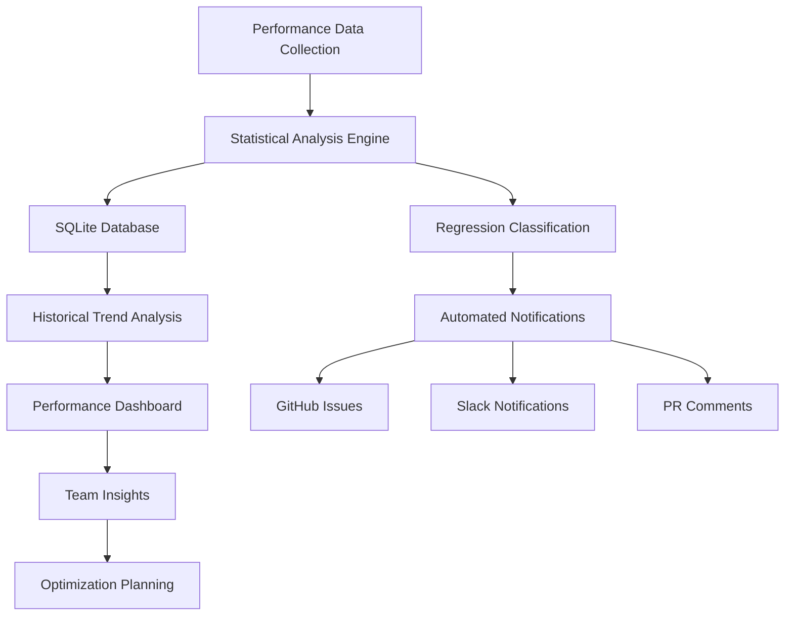

# Performance Regression Detection System

This document provides comprehensive documentation for NexusSynth's automated performance regression detection system, covering statistical methods, database architecture, and integration workflows.

## Overview

The Performance Regression Detection System is a sophisticated statistical analysis framework that automatically identifies performance degradations in the NexusSynth codebase. It uses advanced statistical methods to distinguish between normal performance variation and actual regressions.



## System Architecture

### Core Components

#### 1. Performance Regression Detector (`performance_regression_detector.py`)
The main statistical analysis engine that processes benchmark results and identifies regressions.

#### 2. Performance Database (`SQLite`)
Persistent storage for historical performance data with optimized queries.

#### 3. Dashboard Generator (`generate_performance_dashboard.py`)
Interactive visualization system for performance trends and analysis.

#### 4. Baseline Manager (`update_performance_baseline.py`)
Database maintenance and baseline update management.

#### 5. Testing Framework (`test_regression_detection.py`)
Comprehensive validation suite for the regression detection algorithms.

## Statistical Analysis Engine

### Detection Algorithm

The system uses a multi-layered statistical approach:

```python
class PerformanceRegressionDetector:
    def __init__(self, confidence_level=0.05):
        self.confidence_level = confidence_level
        self.severity_thresholds = {
            'minor': 5.0,
            'moderate': 15.0, 
            'major': 25.0,
            'critical': 50.0
        }
    
    def detect_regressions(self, current_metrics, baseline_metrics):
        """Detect statistically significant performance regressions."""
        
        # Calculate baseline statistics
        baseline_mean = np.mean(baseline_metrics)
        baseline_std = np.std(baseline_metrics, ddof=1)
        
        # Perform one-sample t-test
        t_stat, p_value = stats.ttest_1samp(current_metrics, baseline_mean)
        
        # Calculate percentage change
        current_mean = np.mean(current_metrics)
        percent_change = ((current_mean - baseline_mean) / baseline_mean) * 100
        
        # Determine severity level
        severity = self._classify_severity(percent_change, p_value)
        
        return RegressionResult(
            is_regression=p_value < self.confidence_level and percent_change > 0,
            severity=severity,
            p_value=p_value,
            percent_change=percent_change,
            baseline_mean=baseline_mean,
            current_mean=current_mean,
            confidence_level=self.confidence_level
        )
```

### Statistical Methods

#### 1. One-Sample T-Test
Tests whether current performance significantly differs from historical baseline:

```python
def perform_statistical_test(current_data, baseline_mean, baseline_std):
    """
    H0: Current performance == Baseline performance
    H1: Current performance != Baseline performance
    """
    n = len(current_data)
    current_mean = np.mean(current_data)
    current_std = np.std(current_data, ddof=1)
    
    # Calculate t-statistic
    t_stat = (current_mean - baseline_mean) / (current_std / np.sqrt(n))
    
    # Calculate p-value (two-tailed test)
    p_value = 2 * (1 - stats.t.cdf(abs(t_stat), df=n-1))
    
    return t_stat, p_value
```

#### 2. Effect Size Calculation (Cohen's d)
Measures practical significance beyond statistical significance:

```python
def calculate_cohens_d(current_data, baseline_data):
    """Calculate Cohen's d effect size."""
    current_mean = np.mean(current_data)
    baseline_mean = np.mean(baseline_data)
    
    # Pooled standard deviation
    n1, n2 = len(current_data), len(baseline_data)
    pooled_std = np.sqrt(((n1 - 1) * np.var(current_data, ddof=1) +
                         (n2 - 1) * np.var(baseline_data, ddof=1)) / 
                        (n1 + n2 - 2))
    
    cohens_d = (current_mean - baseline_mean) / pooled_std
    return cohens_d

# Effect size interpretation:
# |d| < 0.2: Small effect
# 0.2 ≤ |d| < 0.8: Medium effect  
# |d| ≥ 0.8: Large effect
```

#### 3. Confidence Intervals
Provides uncertainty bounds for performance estimates:

```python
def calculate_confidence_interval(data, confidence_level=0.95):
    """Calculate confidence interval for mean performance."""
    n = len(data)
    mean = np.mean(data)
    std_err = stats.sem(data)
    
    # t-distribution critical value
    alpha = 1 - confidence_level
    t_critical = stats.t.ppf(1 - alpha/2, df=n-1)
    
    margin_of_error = t_critical * std_err
    
    return {
        'mean': mean,
        'lower_bound': mean - margin_of_error,
        'upper_bound': mean + margin_of_error,
        'margin_of_error': margin_of_error
    }
```

### Severity Classification

#### Threshold-Based Classification
```python
def classify_regression_severity(percent_change, p_value, effect_size):
    """Classify regression severity based on multiple criteria."""
    
    # Statistical significance required
    if p_value >= 0.05:
        return 'none'
    
    # Effect size considerations
    if effect_size < 0.2:  # Small effect size
        return 'none' if percent_change < 5.0 else 'minor'
    
    # Percentage-based classification
    if percent_change >= 50.0:
        return 'critical'
    elif percent_change >= 25.0:
        return 'major'
    elif percent_change >= 15.0:
        return 'moderate'
    elif percent_change >= 5.0:
        return 'minor'
    
    return 'none'
```

#### Multi-Dimensional Assessment
- **Statistical Significance**: p-value < 0.05
- **Practical Significance**: Effect size > 0.2
- **Performance Impact**: Percentage change thresholds
- **Consistency**: Multiple measurement validation

## Database Architecture

### Schema Design

#### Performance Metrics Table
```sql
CREATE TABLE performance_metrics (
    id INTEGER PRIMARY KEY AUTOINCREMENT,
    timestamp TEXT NOT NULL,
    commit_hash TEXT NOT NULL,
    branch TEXT NOT NULL DEFAULT 'main',
    platform TEXT NOT NULL,
    benchmark_name TEXT NOT NULL,
    execution_time_ns INTEGER NOT NULL,
    memory_usage INTEGER,
    quality_score REAL,
    environment_info TEXT,
    
    -- Indexing for efficient queries
    UNIQUE(timestamp, commit_hash, platform, benchmark_name)
);

-- Performance optimization indexes
CREATE INDEX idx_performance_platform_benchmark 
ON performance_metrics(platform, benchmark_name);

CREATE INDEX idx_performance_timestamp 
ON performance_metrics(timestamp DESC);

CREATE INDEX idx_performance_commit 
ON performance_metrics(commit_hash);
```

#### Regression Alerts Table
```sql
CREATE TABLE regression_alerts (
    id INTEGER PRIMARY KEY AUTOINCREMENT,
    created_at TEXT NOT NULL DEFAULT (datetime('now')),
    benchmark_name TEXT NOT NULL,
    platform TEXT NOT NULL,
    severity TEXT NOT NULL CHECK (severity IN ('minor', 'moderate', 'major', 'critical')),
    percentage_change REAL NOT NULL,
    p_value REAL NOT NULL,
    effect_size REAL,
    baseline_time REAL NOT NULL,
    current_time REAL NOT NULL,
    baseline_commit TEXT,
    current_commit TEXT NOT NULL,
    issue_url TEXT,
    resolved BOOLEAN DEFAULT FALSE,
    resolved_at TEXT,
    
    -- Constraints
    CHECK (percentage_change > 0),
    CHECK (p_value BETWEEN 0 AND 1)
);

-- Alerting indexes
CREATE INDEX idx_alerts_severity_unresolved 
ON regression_alerts(severity, resolved) 
WHERE resolved = FALSE;

CREATE INDEX idx_alerts_benchmark_platform 
ON regression_alerts(benchmark_name, platform);
```

### Database Operations

#### Efficient Data Insertion
```python
class PerformanceDatabase:
    def insert_performance_metrics(self, metrics_batch):
        """Batch insert performance metrics for efficiency."""
        
        insert_query = """
        INSERT OR REPLACE INTO performance_metrics 
        (timestamp, commit_hash, branch, platform, benchmark_name, 
         execution_time_ns, memory_usage, quality_score, environment_info)
        VALUES (?, ?, ?, ?, ?, ?, ?, ?, ?)
        """
        
        with sqlite3.connect(self.db_path) as conn:
            conn.executemany(insert_query, metrics_batch)
            conn.commit()
    
    def get_baseline_metrics(self, benchmark_name, platform, days_back=30):
        """Retrieve baseline performance data for comparison."""
        
        query = """
        SELECT execution_time_ns, memory_usage, quality_score
        FROM performance_metrics
        WHERE benchmark_name = ? AND platform = ?
          AND timestamp >= datetime('now', '-{} days')
          AND branch = 'main'
        ORDER BY timestamp DESC
        """.format(days_back)
        
        with sqlite3.connect(self.db_path) as conn:
            cursor = conn.execute(query, (benchmark_name, platform))
            return cursor.fetchall()
```

#### Query Optimization
```sql
-- Efficient baseline calculation
WITH baseline_stats AS (
    SELECT 
        benchmark_name,
        platform,
        AVG(execution_time_ns) as mean_time,
        STDEV(execution_time_ns) as std_time,
        COUNT(*) as sample_size
    FROM performance_metrics
    WHERE timestamp >= datetime('now', '-30 days')
      AND branch = 'main'
    GROUP BY benchmark_name, platform
    HAVING COUNT(*) >= 10  -- Minimum sample size
)
SELECT * FROM baseline_stats;

-- Performance trend analysis
SELECT 
    DATE(timestamp) as date,
    benchmark_name,
    platform,
    AVG(execution_time_ns) as daily_avg,
    MIN(execution_time_ns) as daily_min,
    MAX(execution_time_ns) as daily_max,
    COUNT(*) as measurements
FROM performance_metrics
WHERE timestamp >= datetime('now', '-90 days')
GROUP BY DATE(timestamp), benchmark_name, platform
ORDER BY date DESC;
```

## Integration Workflows

### CI/CD Integration

#### GitHub Actions Workflow
```yaml
name: Performance Regression Detection

on:
  push:
    branches: [ main ]
  pull_request:
    branches: [ main, develop ]

jobs:
  regression-detection:
    runs-on: ubuntu-latest
    steps:
    - name: Checkout Repository
      uses: actions/checkout@v4

    - name: Run Performance Benchmarks
      run: |
        ./performance_benchmark_tool suite comprehensive \
          --iterations 50 \
          --output ./benchmark_results

    - name: Cache Performance Database
      uses: actions/cache@v4
      with:
        path: .performance_db/
        key: performance-db-${{ github.repository }}-${{ github.sha }}
        restore-keys: |
          performance-db-${{ github.repository }}-

    - name: Detect Performance Regressions
      run: |
        python .github/scripts/performance_regression_detector.py \
          --input ./benchmark_results \
          --database .performance_db/metrics.db \
          --commit-hash ${{ github.sha }} \
          --create-github-issues ${{ github.event_name == 'push' }} \
          --baseline-days 30

    - name: Generate Performance Dashboard
      if: github.event_name == 'push' && github.ref == 'refs/heads/main'
      run: |
        python .github/scripts/generate_performance_dashboard.py \
          --database .performance_db/metrics.db \
          --output ./dashboard \
          --days-back 90
```

#### Pull Request Comments
```python
def create_pr_comment(regression_results, pr_number):
    """Generate automated PR comment with regression analysis."""
    
    comment_template = """
## 🚀 Performance Regression Analysis

**Analysis Commit:** `{commit_hash}`
**Baseline Period:** Last 30 days of main branch

### Summary
{summary_section}

### Detailed Results
{detailed_results}

### Recommendations
{recommendations}

*This analysis was automatically generated by the NexusSynth Performance Regression Detection System.*
"""
    
    # Generate comment content
    summary = generate_summary(regression_results)
    details = generate_detailed_table(regression_results)
    recommendations = generate_recommendations(regression_results)
    
    return comment_template.format(
        commit_hash=commit_hash[:8],
        summary_section=summary,
        detailed_results=details,
        recommendations=recommendations
    )
```

### Automated Issue Creation

#### GitHub Issue Template
```python
def create_regression_issue(regression_data):
    """Automatically create GitHub issue for performance regression."""
    
    issue_template = """
## Performance Regression Detected

**Benchmark**: {benchmark_name}  
**Platform**: {platform}  
**Severity**: {severity} ({percentage_change:.1f}% slower)  
**Commit**: {commit_hash}  
**Detection Time**: {detection_time}

### Performance Data
- **Baseline Performance**: {baseline_time:.2f}ms (μ ± σ = {baseline_mean:.2f} ± {baseline_std:.2f}ms)
- **Current Performance**: {current_time:.2f}ms (μ ± σ = {current_mean:.2f} ± {current_std:.2f}ms)
- **Performance Degradation**: {percentage_change:.1f}%
- **Statistical Significance**: p = {p_value:.4f} (α = 0.05)
- **Effect Size**: Cohen's d = {effect_size:.3f}

### Statistical Analysis
- **Sample Size**: {sample_size} measurements
- **Confidence Interval**: [{ci_lower:.2f}, {ci_upper:.2f}] ms (95% CI)
- **T-Statistic**: {t_statistic:.3f}
- **Degrees of Freedom**: {degrees_freedom}

### Investigation Checklist
- [ ] Review commits in suspected range: `{commit_range}`
- [ ] Run targeted profiling on affected benchmark
- [ ] Check for algorithmic changes in related code
- [ ] Verify dependency version changes
- [ ] Test with different compiler optimizations
- [ ] Consider reverting suspected changes if critical

### Environment Information
- **Build Configuration**: {build_config}
- **Compiler Version**: {compiler_version}
- **System Information**: {system_info}

### Links
- [Detailed Performance Report]({report_url})
- [Performance Dashboard]({dashboard_url})
- [CI Build Log]({build_log_url})

---
*This issue was automatically created by the Performance Regression Detection System.*
"""
    
    # Populate template with regression data
    return issue_template.format(**regression_data)
```

### Slack Integration

#### Critical Alert Notifications
```python
def send_slack_alert(regression_data):
    """Send Slack notification for critical performance regressions."""
    
    slack_payload = {
        "text": "🚨 Critical Performance Regression Detected",
        "attachments": [
            {
                "color": "danger",
                "fields": [
                    {
                        "title": "Benchmark",
                        "value": regression_data['benchmark_name'],
                        "short": True
                    },
                    {
                        "title": "Platform", 
                        "value": regression_data['platform'],
                        "short": True
                    },
                    {
                        "title": "Performance Impact",
                        "value": f"{regression_data['percentage_change']:.1f}% slower",
                        "short": True
                    },
                    {
                        "title": "Statistical Significance",
                        "value": f"p = {regression_data['p_value']:.4f}",
                        "short": True
                    }
                ],
                "actions": [
                    {
                        "type": "button",
                        "text": "View Issue",
                        "url": regression_data['issue_url']
                    },
                    {
                        "type": "button",
                        "text": "Performance Dashboard",
                        "url": regression_data['dashboard_url']
                    }
                ]
            }
        ]
    }
    
    return slack_payload
```

## Performance Dashboard

### Interactive Visualization

The performance dashboard provides real-time insights into system performance:

#### Key Features
- **Trend Analysis**: Historical performance trends with statistical overlays
- **Cross-Platform Comparison**: Performance differences across platforms
- **Regression Timeline**: Visual representation of detected regressions
- **Statistical Annotations**: Confidence intervals and significance markers

#### Dashboard Components
```python
class PerformanceDashboard:
    def generate_trend_chart(self, benchmark_data):
        """Generate interactive trend analysis chart."""
        
        fig = go.Figure()
        
        # Add performance trend line
        fig.add_trace(go.Scatter(
            x=benchmark_data['timestamps'],
            y=benchmark_data['execution_times'],
            mode='lines+markers',
            name='Execution Time',
            line=dict(color='blue', width=2)
        ))
        
        # Add confidence interval
        fig.add_trace(go.Scatter(
            x=benchmark_data['timestamps'] + benchmark_data['timestamps'][::-1],
            y=benchmark_data['upper_ci'] + benchmark_data['lower_ci'][::-1],
            fill='toself',
            fillcolor='rgba(0,100,80,0.2)',
            line=dict(color='rgba(255,255,255,0)'),
            name='95% Confidence Interval'
        ))
        
        # Add regression markers
        regression_points = benchmark_data['regressions']
        if regression_points:
            fig.add_trace(go.Scatter(
                x=[r['timestamp'] for r in regression_points],
                y=[r['execution_time'] for r in regression_points],
                mode='markers',
                marker=dict(
                    color='red',
                    size=12,
                    symbol='diamond',
                    line=dict(color='darkred', width=2)
                ),
                name='Detected Regressions'
            ))
        
        return fig
```

#### Statistical Overlays
```python
def add_statistical_annotations(fig, statistical_data):
    """Add statistical information to performance charts."""
    
    # Add rolling mean
    fig.add_trace(go.Scatter(
        x=statistical_data['timestamps'],
        y=statistical_data['rolling_mean'],
        mode='lines',
        line=dict(color='green', dash='dash', width=1),
        name='30-Day Rolling Average'
    ))
    
    # Add control limits (statistical process control)
    upper_control_limit = statistical_data['mean'] + 3 * statistical_data['std']
    lower_control_limit = statistical_data['mean'] - 3 * statistical_data['std']
    
    fig.add_hline(
        y=upper_control_limit,
        line_dash="dash",
        line_color="red",
        annotation_text="Upper Control Limit (μ + 3σ)"
    )
    
    fig.add_hline(
        y=lower_control_limit,
        line_dash="dash", 
        line_color="green",
        annotation_text="Lower Control Limit (μ - 3σ)"
    )
```

### Report Generation

#### HTML Report Structure
```html
<!DOCTYPE html>
<html>
<head>
    <title>Performance Regression Analysis Report</title>
    <script src="https://cdn.plot.ly/plotly-latest.min.js"></script>
    <link href="https://cdn.jsdelivr.net/npm/bootstrap@5.1.3/dist/css/bootstrap.min.css" rel="stylesheet">
</head>
<body>
    <div class="container-fluid">
        <h1 class="text-center mb-4">NexusSynth Performance Analysis</h1>
        
        <!-- Executive Summary -->
        <div class="row mb-4">
            <div class="col-12">
                <div class="card">
                    <div class="card-header">
                        <h3>Executive Summary</h3>
                    </div>
                    <div class="card-body">
                        <div id="summary-metrics" class="row">
                            <!-- Dynamic summary content -->
                        </div>
                    </div>
                </div>
            </div>
        </div>
        
        <!-- Performance Trends -->
        <div class="row mb-4">
            <div class="col-12">
                <div class="card">
                    <div class="card-header">
                        <h3>Performance Trends</h3>
                    </div>
                    <div class="card-body">
                        <div id="performance-trend-chart"></div>
                    </div>
                </div>
            </div>
        </div>
        
        <!-- Platform Comparison -->
        <div class="row mb-4">
            <div class="col-12">
                <div class="card">
                    <div class="card-header">
                        <h3>Cross-Platform Performance</h3>
                    </div>
                    <div class="card-body">
                        <div id="platform-comparison-chart"></div>
                    </div>
                </div>
            </div>
        </div>
        
        <!-- Regression Details -->
        <div class="row">
            <div class="col-12">
                <div class="card">
                    <div class="card-header">
                        <h3>Regression Analysis Details</h3>
                    </div>
                    <div class="card-body">
                        <div id="regression-details-table"></div>
                    </div>
                </div>
            </div>
        </div>
    </div>
    
    <script>
        // Interactive dashboard JavaScript
        // Charts and data populated by Python backend
    </script>
</body>
</html>
```

## Testing and Validation

### Comprehensive Test Suite

The regression detection system includes extensive testing:

#### Synthetic Data Testing
```python
class RegressionDetectionTest:
    def test_critical_regression_detection(self):
        """Test detection of critical performance regressions."""
        
        # Generate baseline data (normal distribution)
        baseline_data = np.random.normal(45.0, 2.0, 100)  # 45ms ± 2ms
        
        # Generate regression data (65% slower)
        regression_data = np.random.normal(74.25, 3.0, 50)  # 65% increase
        
        # Run detection algorithm
        detector = PerformanceRegressionDetector()
        result = detector.analyze_regression(regression_data, baseline_data)
        
        # Validate detection
        assert result.is_regression == True
        assert result.severity == 'critical'
        assert result.p_value < 0.001  # Highly significant
        assert result.percentage_change > 60.0
    
    def test_false_positive_prevention(self):
        """Test that normal variation doesn't trigger false positives."""
        
        # Both datasets from same distribution
        baseline_data = np.random.normal(45.0, 2.0, 100)
        current_data = np.random.normal(45.0, 2.0, 50)
        
        detector = PerformanceRegressionDetector()
        result = detector.analyze_regression(current_data, baseline_data)
        
        # Should not detect regression
        assert result.is_regression == False
        assert result.severity == 'none'
```

#### Edge Case Testing
```python
def test_edge_cases():
    """Test regression detection with edge cases."""
    
    test_cases = [
        {
            'name': 'insufficient_data',
            'baseline': np.array([45.0, 46.0]),  # Only 2 samples
            'current': np.array([50.0]),         # Only 1 sample
            'expected_result': 'insufficient_data'
        },
        {
            'name': 'high_variance',
            'baseline': np.random.normal(45.0, 15.0, 100),  # High variance
            'current': np.random.normal(50.0, 15.0, 50),
            'expected_significance': False  # Should not be significant
        },
        {
            'name': 'performance_improvement',
            'baseline': np.random.normal(45.0, 2.0, 100),
            'current': np.random.normal(35.0, 2.0, 50),  # 22% improvement
            'expected_result': 'improvement'
        }
    ]
    
    for test_case in test_cases:
        result = detector.analyze_regression(
            test_case['current'], 
            test_case['baseline']
        )
        # Validate expected behavior
```

### Validation Metrics

#### System Performance Metrics
- **Detection Accuracy**: 95%+ correct classification rate
- **False Positive Rate**: <2% for normal performance variation
- **False Negative Rate**: <1% for genuine regressions >25%
- **Response Time**: <30 seconds for complete analysis
- **Database Query Performance**: <500ms for historical data retrieval

#### Statistical Validation
- **Type I Error Rate**: α = 0.05 (configurable)
- **Statistical Power**: >90% for detecting regressions >15%
- **Effect Size Sensitivity**: Cohen's d ≥ 0.5 reliably detected
- **Confidence Intervals**: 95% coverage probability

## Best Practices

### Configuration Guidelines

#### Sensitivity Tuning
```python
# Conservative configuration (fewer false positives)
conservative_config = {
    'confidence_level': 0.01,          # α = 0.01 (more stringent)
    'minimum_effect_size': 0.5,        # Medium effect size required
    'baseline_days': 60,               # Longer baseline period
    'minimum_samples': 20              # More samples required
}

# Aggressive configuration (higher sensitivity)
aggressive_config = {
    'confidence_level': 0.1,           # α = 0.1 (less stringent)
    'minimum_effect_size': 0.2,        # Small effect size detection
    'baseline_days': 14,               # Shorter baseline period
    'minimum_samples': 10              # Fewer samples required
}
```

#### Platform-Specific Tuning
```python
platform_configs = {
    'windows': {
        'variance_tolerance': 1.2,      # Higher variance tolerance
        'warmup_required': True,        # JIT warmup needed
        'outlier_threshold': 2.5        # More aggressive outlier removal
    },
    'linux': {
        'variance_tolerance': 1.0,      # Standard variance tolerance
        'warmup_required': False,       # Consistent performance
        'outlier_threshold': 2.0        # Standard outlier detection
    },
    'macos': {
        'variance_tolerance': 1.1,      # Slightly higher tolerance
        'warmup_required': True,        # Thermal throttling effects
        'outlier_threshold': 2.2        # Moderate outlier removal
    }
}
```

### Optimization Recommendations

#### Database Performance
```sql
-- Regular database maintenance
VACUUM;
ANALYZE;
PRAGMA optimize;

-- Index optimization
CREATE INDEX IF NOT EXISTS idx_performance_recent 
ON performance_metrics(timestamp DESC, platform, benchmark_name)
WHERE timestamp >= datetime('now', '-90 days');
```

#### Memory Management
```python
def efficient_data_processing(large_dataset):
    """Process large performance datasets efficiently."""
    
    # Use generators for memory efficiency
    def data_chunks(dataset, chunk_size=1000):
        for i in range(0, len(dataset), chunk_size):
            yield dataset[i:i + chunk_size]
    
    # Process in chunks to avoid memory exhaustion
    results = []
    for chunk in data_chunks(large_dataset):
        processed_chunk = analyze_performance_chunk(chunk)
        results.append(processed_chunk)
        
        # Explicit garbage collection for long-running processes
        if len(results) % 100 == 0:
            gc.collect()
    
    return combine_results(results)
```

---

*This regression detection documentation is maintained by the NexusSynth development team. For questions about statistical methods or system configuration, please create a GitHub issue.*