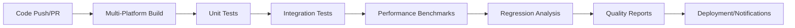

# NexusSynth Testing Guide

This comprehensive guide covers all aspects of testing in the NexusSynth vocal synthesis resampler project, from basic unit tests to advanced performance regression detection.

## Table of Contents

1. [Overview](#overview)
2. [Testing Infrastructure](#testing-infrastructure)
3. [Running Tests](#running-tests)
4. [CI/CD Pipeline](#cicd-pipeline)
5. [Performance Benchmarking](#performance-benchmarking)
6. [Regression Detection](#regression-detection)
7. [Quality Assurance](#quality-assurance)
8. [Contributing Guidelines](#contributing-guidelines)
9. [Troubleshooting](#troubleshooting)

## Overview

NexusSynth employs a multi-layered testing approach designed to ensure reliability, performance, and quality of the vocal synthesis engine:

- **Unit Tests**: Component-level testing of individual functions and classes
- **Integration Tests**: End-to-end testing with real voice banks and synthesis workflows
- **Performance Benchmarks**: Automated performance measurement and regression detection
- **Quality Analysis**: A/B testing against existing resamplers with objective metrics
- **Continuous Integration**: Multi-platform automated testing on every code change

### Testing Philosophy

Our testing strategy follows these principles:
- **Comprehensive Coverage**: Every critical path is tested
- **Automated Validation**: Tests run automatically on every commit
- **Performance Awareness**: Performance regressions are detected immediately
- **Quality First**: Audio quality is measured objectively
- **Community Ready**: Tests prepare the software for community beta testing

## Testing Infrastructure

### Core Components

```
tests/
├── integration/           # End-to-end and integration tests
│   ├── ab_comparison/    # A/B quality comparison tools
│   ├── benchmarks/       # Performance measurement framework
│   ├── config/           # Test configuration files
│   ├── conversion/       # Voice bank conversion tests
│   ├── synthesis/        # Full synthesis pipeline tests
│   └── utils/           # Testing utilities and helpers
├── test_*.cpp           # Unit tests for individual components
└── CMakeLists.txt       # Test configuration and build rules
```

### Key Testing Tools

- **A/B Comparison Framework** (`tests/integration/ab_comparison/`)
  - Objective audio quality comparison
  - Statistical significance testing
  - Visual result reporting
  
- **Performance Benchmark Suite** (`tests/integration/benchmarks/`)
  - Multi-threaded performance measurement
  - Memory usage profiling
  - Cross-platform compatibility testing
  
- **Quality Analyzer** (`tests/integration/utils/quality_analyzer.h`)
  - SNR, spectral similarity, and cross-correlation metrics
  - Formant preservation analysis
  - Automated quality scoring

## Running Tests

### Prerequisites

Ensure NexusSynth is properly built with testing enabled:

```bash
mkdir build && cd build
cmake .. -DNEXUSSYNTH_BUILD_TESTS=ON
make -j$(nproc)
```

### Basic Test Execution

#### Run All Tests
```bash
# From build directory
ctest --verbose
```

#### Run Specific Test Categories
```bash
# Unit tests only (fast)
ctest -L unit --verbose

# Integration tests only
ctest -L integration --verbose

# Performance benchmarks
ctest -L performance --verbose
```

#### Run Individual Tests
```bash
# Specific component tests
./test_world_wrapper
./test_mlpg_engine
./test_pbp_synthesis_engine

# Integration tests
./tests/integration/ab_comparison/test_ab_comparator
./tests/integration/benchmarks/test_performance_benchmark
```

### Advanced Testing Options

#### Comprehensive Performance Benchmarking
```bash
# Run full performance benchmark suite
./tests/integration/benchmarks/performance_benchmark_tool \
    suite comprehensive \
    --iterations 50 \
    --output ./benchmark_results \
    --json --csv \
    --detailed-metrics
```

#### A/B Quality Comparison
```bash
# Compare NexusSynth vs moresampler
./tests/integration/ab_comparison/ab_comparison_tool \
    --config ../config/ab_comparison_config.json \
    --voice-bank /path/to/voicebank \
    --output ./comparison_results \
    --format html
```

## CI/CD Pipeline

Our CI/CD pipeline provides comprehensive automated testing across multiple platforms and scenarios.

### Workflow Overview



### Available Workflows

#### 1. Main CI Pipeline (`ci.yml`)
- **Triggers**: Push to main/develop, Pull Requests
- **Platforms**: Windows (MSVC 2022), Ubuntu (GCC/Clang), macOS (Intel/ARM64)
- **Features**:
  - Matrix builds with parallel execution
  - CodeQL security analysis
  - Comprehensive test execution
  - Artifact management with retention policies
  - Performance baseline collection

#### 2. Nightly Builds (`nightly-builds.yml`)
- **Triggers**: Daily at 2 AM UTC
- **Purpose**: Extended performance testing and stability analysis
- **Features**:
  - Long-running benchmark suites (100+ iterations)
  - Memory stress testing
  - Performance trend analysis
  - Automatic baseline updates

#### 3. Pull Request Validation (`pull-request.yml`)
- **Triggers**: Pull Request creation/updates
- **Features**:
  - Smart testing based on changed files
  - Performance impact assessment vs baseline
  - Quality assurance checks
  - Automatic PR comments with results

#### 4. Performance Regression Detection (`performance-regression-detection.yml`)
- **Triggers**: Push to main, PR creation, manual dispatch
- **Features**:
  - Statistical regression detection (5-50% thresholds)
  - Multi-platform performance database
  - Automatic GitHub issue creation for regressions
  - Slack notifications for critical issues

#### 5. Release Pipeline (`release.yml`)
- **Triggers**: Git tag creation
- **Features**:
  - Multi-platform release builds
  - Comprehensive validation testing
  - Automatic release artifact generation
  - Performance validation reports

### Workflow Configuration

All workflows support customizable parameters:

```yaml
# Example manual trigger with custom parameters
workflow_dispatch:
  inputs:
    benchmark_iterations:
      description: 'Number of benchmark iterations'
      required: false
      default: '50'
    create_github_issues:
      description: 'Create GitHub issues for regressions'
      type: boolean
      default: true
```

## Performance Benchmarking

### Benchmark Framework Architecture

The performance benchmark system (`tests/integration/benchmarks/`) provides comprehensive performance measurement capabilities:

```cpp
// Core benchmarking components
class PerformanceBenchmark {
    void run_benchmark_suite(BenchmarkSuite suite, int iterations);
    BenchmarkResult measure_synthesis_performance();
    MemoryProfile profile_memory_usage();
    void generate_performance_report();
};
```

### Available Benchmark Suites

#### 1. Comprehensive Suite
- **WORLD Analysis**: F0/SP/AP parameter extraction
- **HMM Training**: Statistical model training performance
- **MLPG Generation**: Parameter trajectory optimization
- **Pulse-by-Pulse Synthesis**: Real-time synthesis performance

#### 2. Memory Profiling Suite
- Peak allocation tracking
- Memory leak detection
- Garbage collection impact analysis

#### 3. Multi-threading Suite
- Thread scalability analysis
- Lock contention measurement
- Parallel processing efficiency

### Benchmark Execution

#### Command-Line Interface
```bash
# Basic benchmark execution
./performance_benchmark_tool suite basic --iterations 20

# Comprehensive benchmarking with detailed output
./performance_benchmark_tool suite comprehensive \
    --iterations 50 \
    --warmup 5 \
    --output ./results \
    --json --csv \
    --detailed-metrics \
    --include-environment-info
```

#### Configuration Options
```json
{
  "benchmark_config": {
    "iterations": 50,
    "warmup_iterations": 5,
    "timeout_seconds": 300,
    "memory_profiling": true,
    "thread_analysis": true,
    "quality_validation": true
  }
}
```

### Performance Metrics

Our benchmarking framework measures:

- **Execution Time**: Nanosecond precision timing
- **Memory Usage**: Peak allocation and working set
- **Thread Performance**: Scalability and efficiency
- **Quality Metrics**: Formant preservation, spectral accuracy
- **System Resources**: CPU usage, I/O operations

## Regression Detection

### Statistical Regression Analysis

The regression detection system (`performance_regression_detector.py`) uses advanced statistical methods to identify performance degradations:

#### Detection Algorithm
```python
class PerformanceRegressionDetector:
    def detect_regressions(self, current_metrics, baseline_metrics):
        # Statistical t-test with configurable confidence levels
        t_stat, p_value = stats.ttest_1samp(current_metrics, baseline_mean)
        
        # Multi-tier severity classification
        if percent_change > 50.0:
            return "critical"
        elif percent_change > 25.0:
            return "major"
        elif percent_change > 15.0:
            return "moderate"
        elif percent_change > 5.0:
            return "minor"
        
        return "none"
```

#### Severity Thresholds
- **Critical**: >50% performance degradation
- **Major**: 25-50% degradation
- **Moderate**: 15-25% degradation  
- **Minor**: 5-15% degradation

### Database Schema

Performance data is stored in SQLite with the following structure:

```sql
CREATE TABLE performance_metrics (
    id INTEGER PRIMARY KEY,
    timestamp TEXT NOT NULL,
    commit_hash TEXT NOT NULL,
    branch TEXT NOT NULL,
    platform TEXT NOT NULL,
    benchmark_name TEXT NOT NULL,
    execution_time_ns INTEGER NOT NULL,
    memory_usage INTEGER,
    quality_score REAL,
    environment_info TEXT
);

CREATE TABLE regression_alerts (
    id INTEGER PRIMARY KEY,
    created_at TEXT NOT NULL,
    benchmark_name TEXT NOT NULL,
    platform TEXT NOT NULL,
    severity TEXT NOT NULL,
    percentage_change REAL NOT NULL,
    baseline_time REAL NOT NULL,
    current_time REAL NOT NULL,
    commit_hash TEXT NOT NULL,
    issue_url TEXT
);
```

### Automated Notifications

The system automatically creates GitHub issues for critical regressions:

```markdown
## Performance Regression Detected

**Benchmark**: WORLD_Analysis  
**Platform**: Ubuntu GCC  
**Severity**: Critical (65% slower)  
**Commit**: abc123de  

### Performance Data
- **Baseline**: 45.2ms
- **Current**: 74.6ms
- **Degradation**: 65.0%

### Investigation Checklist
- [ ] Review commits in suspected range
- [ ] Run targeted profiling on affected benchmark
- [ ] Check for algorithmic changes
- [ ] Verify dependency version changes
```

## Quality Assurance

### A/B Comparison Framework

The A/B comparison system provides objective quality assessment between NexusSynth and existing resamplers:

#### Quality Metrics
```cpp
class QualityAnalyzer {
    double calculate_snr(const AudioBuffer& reference, const AudioBuffer& test);
    double calculate_spectral_similarity(const AudioBuffer& a, const AudioBuffer& b);
    double calculate_cross_correlation(const AudioBuffer& a, const AudioBuffer& b);
    double calculate_formant_preservation(const AudioBuffer& original, const AudioBuffer& processed);
};
```

#### Comparison Workflow
1. **Input Preparation**: Standardized test cases with known reference outputs
2. **Parallel Processing**: Both NexusSynth and reference resampler process the same input
3. **Objective Measurement**: Multiple quality metrics calculated automatically
4. **Statistical Analysis**: T-tests determine statistical significance
5. **Report Generation**: HTML reports with visualizations and detailed analysis

### Test Data Management

The test data manager (`test_data_manager.h`) provides:
- Standardized voice bank test sets
- Reproducible test scenarios
- Consistent input/output validation
- Version control integration

## Contributing Guidelines

### Adding New Tests

#### Unit Tests
```cpp
#include <gtest/gtest.h>
#include "nexussynth/your_component.h"

class YourComponentTest : public ::testing::Test {
protected:
    void SetUp() override {
        // Test setup
    }
};

TEST_F(YourComponentTest, BasicFunctionality) {
    YourComponent component;
    EXPECT_TRUE(component.initialize());
    EXPECT_EQ(component.process_data(input), expected_output);
}
```

#### Integration Tests
```cpp
TEST(IntegrationTest, EndToEndSynthesis) {
    // Load test voice bank
    VoiceBank voice_bank("test_data/voice_bank");
    
    // Create synthesis request
    SynthesisRequest request;
    request.phoneme = "a";
    request.pitch = 440.0;
    request.duration = 1000;
    
    // Process and validate
    AudioBuffer result = synthesize(voice_bank, request);
    EXPECT_GT(calculate_audio_quality(result), 0.85);
}
```

### Performance Test Guidelines

When adding performance tests:
1. Use consistent iteration counts (50+ for benchmarks)
2. Include warmup iterations (5-10)
3. Measure multiple metrics (time, memory, quality)
4. Set appropriate timeouts
5. Add regression thresholds

### Test Configuration

Add test labels and timeouts to CMakeLists.txt:
```cmake
create_labeled_test(test_your_component 
    "test_your_component.cpp" 
    "unit;fast" 
    120)  # 2-minute timeout
```

## Troubleshooting

### Common Issues

#### Build Problems
```bash
# Clean rebuild
rm -rf build/
mkdir build && cd build
cmake .. -DNEXUSSYNTH_BUILD_TESTS=ON
make -j$(nproc)
```

#### Test Failures
```bash
# Run specific failing test with verbose output
ctest -R test_failing_component --verbose

# Run with debugging
gdb ./test_failing_component
```

#### Performance Issues
```bash
# Profile performance bottlenecks
valgrind --tool=callgrind ./test_performance_component

# Check memory usage
valgrind --tool=memcheck --leak-check=full ./test_memory_component
```

### CI/CD Debugging

#### View Workflow Logs
1. Navigate to Actions tab in GitHub repository
2. Select the failing workflow run
3. Expand the failing job and step
4. Download logs for local analysis

#### Local CI Simulation
```bash
# Run the same commands as CI locally
cmake .. -DCMAKE_BUILD_TYPE=Release -DNEXUSSYNTH_BUILD_TESTS=ON
make -j$(nproc)
ctest --output-on-failure
```

#### Performance Regression False Positives
- Check system load during CI execution
- Verify baseline data is representative
- Adjust statistical confidence thresholds
- Review environmental factors

### Getting Help

#### Documentation Resources
- **Build System**: `docs/DEPENDENCIES.md`
- **Development Setup**: `CLAUDE.md`
- **Task Management**: `.taskmaster/CLAUDE.md`

#### Community Support
- GitHub Issues: Report bugs and request features
- Discussions: Ask questions and share insights
- Beta Testing: Join community testing programs

#### Development Team Contact
- For critical issues or security concerns
- Performance optimization discussions
- Feature development collaboration

---

*This testing guide is maintained by the NexusSynth development team. Last updated: 2025-08-20*